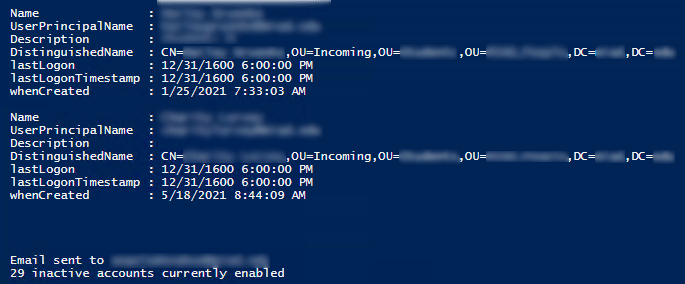

# Find Inactive Active Directory Accounts By Organizational Unit
Search a single OU for accounts in a particular OU created more than 120 days ago.

This script was originally tossed together to search a "starter" OU (where new accounts go before onboarding), if for whatever reason the onboarding doesn't commence, the account won't get moved to its destined OU.  This script can be set to run as a task to send an email about accounts passed 'expiry,' or do a custom behavior, such as move the dormant accounts into a trash OU.

Preview of Powershell ISE output:



## Setup / Customization
- The script has to be run with administrator (or SYSTEM) privileges, else **whenCreated** will be blank
- If the user has never logged in, the timestamp will read `12/31/1600 6:00:00 PM`

Set your target OU:
```powershell
$targetOU = "OU=Incoming,OU=Staff,OU=People,DC=example,DC=com"
```

If you want to run this script as a task, specify your email stuff:
```powershell
$To         = "you@example.com"
# enter any additional recipients, separated by a comma
$From       = "noreply@example.com"
$SMTPServer = "mail.example.com"
$SMTPPort   = "25"
```

Adjust how many days to consider the account inactive (change `-120` to your term of choice):
```powershell
Where-Object { $_.whenCreated -lt (Get-Date).AddDays(-120) }
```
