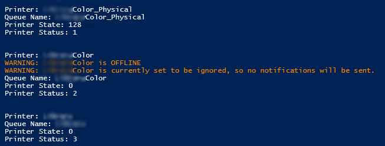

# Track Printer Errors on Windows Print Servers
Small script that can be run manually (or as a scheduled task) to monitor print queues for errors, with the option to auto-delete the problem print from the queue, with an optional email notification.

A preview of debug output from Powershell ISE:


## Latest Update
12/9/21

- Added filters to ignore a particular queue (if you intended to turn it off and no longer need it monitored)
- Debug being enabled won't send email notifications or open Zendesk tickets, now

## Pre-requisites
Out of the box, this may or may not work in your environment without customizations.

This script was originally put together for an environment that uses **virtual** and **physical** queues with Papercut.

If you *don't* have queues with **physical** in the name, be sure to change the `$physicalOnly` variable to **0**.  That may work for you out of the box (but not tested in such environments).

A switch to open a Zendesk ticket, with code components from [PRTG Zendesk Webhook](https://github.com/angela-d/prtg-zendesk-webhook) (PRTG is not required for auto-opening Zendesk tickets)

Other configurable options:
- **$deleteProblems** = Whether or not you want to auto-delete the print causing errors, or just sent an email notification
- **$smtpServer** = Hostname of your mail server
- **$smtpPort** = Port of your mailserver (note that if you're not using a handoff relayer server, such as in this example, be sure to add SMTP user & pass to your script)
- **$from** = Sender of the notifications
- **$to** = Primary recipient of the notifications
- **$cc** = CC recipient of the notifications
- **$printServer** = Hostname of your print server
- **$useZendesk** = Whether or not you want to open a Zendesk ticket when a printer queue is offline (subsequent variables are for Zendesk users, only)
- **$ignoreQueue** = Optionally ignore a particular queue, wildcard to filter both virtual and physical queues

## Caveats
Don't run with `$deleteProblems` active until you test problem scenarios.

## Setup
Can run standalone in Powershell (from the directory where you keep your scripts, for example):
```powershell
cd C:\Users\myuser\Desktop
.\track-printer-errors.ps1
```

Or as a scheduled task.
